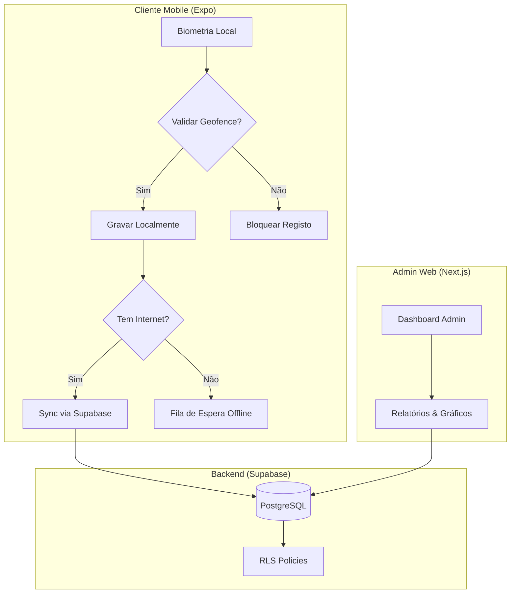

# 🛡️ Bio-Kwenda: Sistema de Ponto Biométrico Inteligente


**Bio-Kwenda** é uma solução de ponta para gestão de assiduidade, combinando a segurança da **identificação biométrica** com a precisão do **Geofencing**. Desenvolvido para empresas modernas que exigem controlo total, mobilidade e transparência.

---

## 🚀 Visão Geral do Ecossistema

O Bio-Kwenda divide-se em dois pilares fundamentais que comunicam em tempo real via **Supabase**:

| Componente | Público-Alvo | Funcionalidades Principais |
| :--- | :--- | :--- |
| **📱 App Mobile** | Funcionários | Ponto via Biometria, Modo Offline, Validação de GPS, Histórico Pessoal. |
| **💻 Web Admin** | RH / Gestores | Dashboard de Métricas, Gestão de Perímetros, Escalas, Férias e Relatórios. |

---

## 📊 Arquitetura de Dados

O fluxo de informação é otimizado para garantir que nenhum registo se perca, mesmo em áreas sem cobertura de rede.



---

## 📍 Controlo de Geofencing (Perímetros)

O sistema valida a presença baseando-se em coordenadas geográficas e raios de tolerância configuráveis.

| Localização | Coordenadas | Raio (m) | Estado |
| :--- | :--- | :--- | :--- |
| **Sede Luanda** | -8.8368, 13.2344 | 200m | ✅ Ativo |
| **Armazém Viana** | -8.9168, 13.3544 | 500m | ✅ Ativo |
| **Filial Talatona** | -8.9268, 13.1844 | 150m | ⚠️ Manutenção |

---

## 🛠️ Tecnologias Utilizadas

O Bio-Kwenda utiliza o que há de mais moderno no desenvolvimento de software premium:

- **Frontend Web**: Next.js 14+ com **Glassmorphism Design**.
- **Mobile**: Expo (React Native) com suporte a Hardware Biometrics.
- **Estilização**: Tailwind CSS v4 para uma interface fluida e moderna.
- **Backend / DB**: Supabase (PostgreSQL, Auth e Realtime).
- **Segurança**: Row Level Security (RLS) para proteção rigorosa de dados.

---

## 📉 Métricas Disponíveis no Dashboard

O painel administrativo oferece uma visão 360º da empresa:

1. **Assiduidade em Tempo Real**: Quem está "dentro" ou "fora" agora.
2. **Alertas de Perímetro**: Notificações instantâneas de tentativas de registo fora da zona permitida.
3. **Sincronização Offline**: Monitorização de dados pendentes de envio.

---

## 📥 Como Instalar e Executar

### 1. Backend (Supabase)

Execute o ficheiro `supabase_schema.sql` no seu editor SQL do Supabase para criar as tabelas e os *triggers* automáticos de perfil.

### 2. Web Admin

```bash
cd web
npm install
npm run dev
```

Aceda a `http://localhost:3000/admin/register` para criar a sua conta master.

### 3. Mobile App

```bash
cd mobile
npm install
npx expo start
```

Use o app **Expo Go** para testar em dispositivos físicos.

---

> [!TIP]
> **Dica de Design**: O Bio-Kwenda utiliza o token de cores `background: #0d1b2a` para um Dark Mode premium que reduz a fadiga visual dos gestores de RH.

---
© 2026 Bio-Kwenda System. Todos os direitos reservados.
